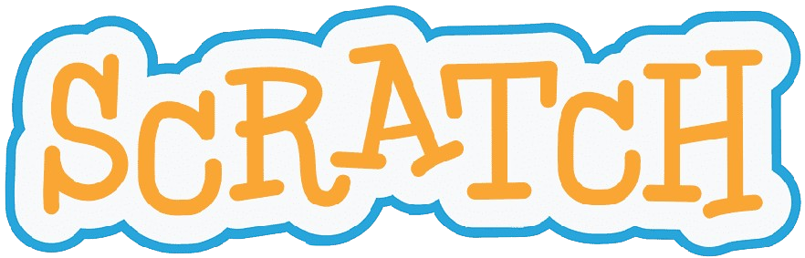

Difana Nanda Pridhasila Zein
2110131220017

# Scratch

  

Scratch adalah platform pemrograman visual yang dibuat khusus untuk pemula dengan antarmuka yang mudah digunakan. Scratch memungkinkan pengguna menciptakan permainan sederhana dan proyek interaktif lainnya tanpa harus menuliskan kode yang rumit.

Salah satu keunggulan Scratch adalah fitur <i><b>drag and drop</b></i> yang memudahkan pengguna dalam menyusun blok-blok kode. Fitur ini membuat pemrograman menjadi lebih mudah dipahami dan membantu menghindari kesalahan yang biasanya terjadi saat menulis kode. Dengan begitu, proses belajar menjadi lebih mudah dan menyenangkan.

### 1. Scratch sebagai Tutor

Scratch membantu pengguna belajar dasar-dasar pemrograman degan cara yang mudah dan menyenangkan. Terdapat tutorial dan panduan yang jelas sehingga pengguna bisa langsung memahami konsep seperti logika dan urutan langkah. Kelebihannya adalah cara belajarnya yang sederhana dan mempunyai tampilan visual yang menarik. 

### 2. Scratch sebagai Tool

Scratch digunakan untuk membuat proyek seperti game sederhana dan animasi. Kita dapat menyusun blok-blok kode dengan cara <i><b>drag and drop</b></i>, sehingga tidak perlu menulis kode secara manual. Kelebihan Scratch sebagai alat adalah antarmukanya yang sederhana, sehingga pengguna lebih mudah dalam menggunakannya.

### 3. Scratch sebagai Tutee

Saat menggunakan Scratch sebagai tutee, kita bisa mengajarkan komputer cara menyelesaikan tugas dengan kode yang kita buat. Kita bisa bereksperimen dengan logika dan langsung melihat hasilnya. Kelebihannya adalah kita bisa belajar dngan cara mencoba sendiri, sehingga lebih cepat memahami cara kerja pemrograman.